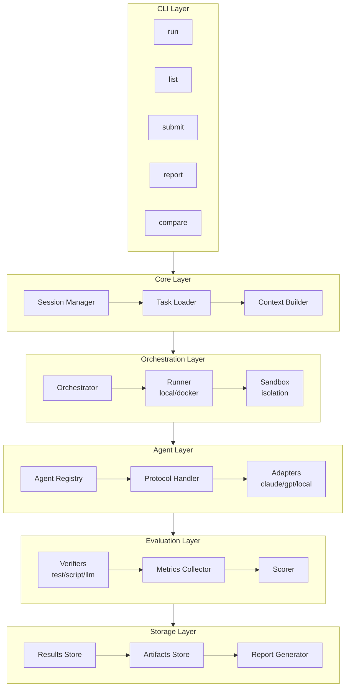

# Agent Bench

An open-source benchmark initiative for evaluating AI coding agents on real-world engineering tasks specific to our workflows.

## Overview

Agent Bench creates reproducible evaluation environments derived from authentic development tasks encountered in our daily work. Unlike synthetic coding benchmarks, Agent Bench focuses on genuine engineering challenges that reflect the complexity of real-world software development.

## Goals

1. **Realistic Evaluation** - Test AI agents on actual engineering problems rather than artificial puzzles
2. **Domain-Specific Assessment** - Measure agent capabilities on tasks relevant to our specific technology stack and workflows
3. **Reproducible Benchmarking** - Provide standardized environments for consistent agent comparison
4. **Continuous Improvement** - Build a growing collection of tasks to track agent progress over time

## How It Works

### Task Collection

Tasks are collected through two channels:

- **Automatic Capture**: Identify challenging tasks where AI agents struggled or required human intervention
- **Manual Submission**: Engineers submit real problems from their development work

### Task Structure

Each benchmark task includes:

| Component | Description |
|-----------|-------------|
| Repository Snapshot | Git commit hash marking the starting state |
| Initial Prompt | The original task description given to the agent |
| Verification Criteria | Automated tests based on the actual solution |
| Metadata | Difficulty level, category, time constraints, etc. |

## Task Categories

- **Bug Fixes** - Debugging and resolving issues in existing code
- **Feature Implementation** - Adding new functionality to existing systems
- **Refactoring** - Code restructuring and optimization tasks
- **Integration** - Connecting systems, APIs, and services
- **Configuration** - Setup, deployment, and DevOps tasks
- **Documentation** - Technical writing and code documentation

## Evaluation Metrics

| Metric | Description |
|--------|-------------|
| Success Rate | Percentage of tasks completed correctly |
| Iteration Count | Number of attempts before success |
| Token Usage | Total tokens consumed during task completion |
| Time to Completion | Duration from start to successful verification |
| Human Intervention | Amount of manual assistance required |

## Getting Started

### Prerequisites

- Python 3.10+
- Git
- Docker (optional, for isolated environments)

### Installation

```bash
git clone https://github.com/your-org/agent-bench.git
cd agent-bench
pip install -e .
```

### Running a Benchmark

```bash
# List available tasks
agent-bench list

# Run a specific task
agent-bench run --task <task-id> --agent <agent-name>

# Run full benchmark suite
agent-bench run --suite all --agent <agent-name>

# Compare agents
agent-bench compare --agents claude,gpt4 --suite all

# Generate report
agent-bench report --format html --output ./reports/
```

## Contributing Tasks

### Submission Guidelines

1. **Real-world Origin** - Tasks must come from actual development work
2. **Reproducibility** - Include all context needed to recreate the scenario
3. **Verifiability** - Provide automated tests that validate the solution
4. **Documentation** - Describe the problem clearly and include expected outcomes

### Task Template

```yaml
version: "1.0"
id: BUG-001
title: "Fix race condition in cache invalidation"
category: bug-fix
difficulty: hard

source:
  repository: https://github.com/org/repo
  commit: abc123def456
  branch: main

environment:
  runtime: python:3.11
  dependencies:
    - requirements.txt
  setup_commands:
    - pip install -e .

prompt: |
  The cache invalidation has a race condition causing
  intermittent test failures. Fix the concurrency issue
  while maintaining existing functionality.

hints:                           # Optional progressive hints
  - level: 1
    text: "Check the locking mechanism"
  - level: 2
    text: "Look at concurrent access patterns"

verification:
  primary:
    type: pytest
    command: "pytest tests/test_cache.py -v"
    timeout: 60
  secondary:
    type: script
    command: "./verify_no_race.sh"

constraints:
  max_iterations: 10
  max_tokens: 100000
  timeout_minutes: 30
  allowed_tools: ["read", "write", "bash"]

metadata:
  author: "engineer@company.com"
  created: "2024-01-15"
  tags: ["concurrency", "caching", "python"]
  estimated_time: "45m"
  real_solution_loc: 12
```

## Project Structure

```
agent-bench/
├── config/                 # Global and agent-specific configurations
├── src/agent_bench/
│   ├── cli/                # Command-line interface
│   ├── core/               # Task models, session, context
│   ├── registry/           # Task, agent, plugin discovery
│   ├── runners/            # Local and Docker execution
│   ├── agents/             # Agent adapters (Claude, GPT, etc.)
│   ├── evaluation/         # Verifiers and metrics collection
│   ├── environment/        # Sandbox isolation, git ops
│   ├── storage/            # Results persistence
│   ├── reporting/          # Report generators
│   └── plugins/            # Extension system
├── tasks/                  # Benchmark task definitions
├── results/                # Run results and comparisons
├── tests/                  # Unit and integration tests
└── docs/                   # Documentation
```

## Architecture



## Key Components

### Registry Pattern

Central discovery and management for tasks, agents, and plugins:

```python
from agent_bench.registry import TaskRegistry

registry = TaskRegistry()
tasks = registry.filter(category="bug-fix", difficulty="hard")
```

### Plugin Architecture

Extensible system for custom verifiers, reporters, and agents:

```python
# pyproject.toml
[project.entry-points."agent_bench.verifiers"]
custom = "my_package:CustomVerifier"
```

### Environment Isolation

Reproducible execution environments with state management:

```python
from agent_bench.environment import DockerSandbox

async with DockerSandbox(task) as sandbox:
    snapshot = await sandbox.snapshot()
    result = await runner.execute(agent, task, sandbox)
    await sandbox.restore(snapshot)  # Reset for next run
```

## Results Schema

```python
# Run results are stored with full provenance
{
    "run_id": "run_20240115_143022_BUG001_claude",
    "task_id": "BUG-001",
    "agent_id": "claude-3-opus",
    "timestamp": "2024-01-15T14:30:22Z",
    "status": "success",
    "metrics": {
        "total_tokens": 45230,
        "input_tokens": 12450,
        "output_tokens": 32780,
        "iterations": 3,
        "duration_seconds": 127.4,
        "tool_calls": {"read": 15, "write": 4, "bash": 8},
        "human_interventions": 0
    },
    "verification_results": [
        {"type": "pytest", "passed": true, "details": "12 tests passed"}
    ]
}
```

## Roadmap

- [ ] Core benchmark infrastructure
- [ ] Task submission and validation pipeline
- [ ] Agent adapter interface
- [ ] Results dashboard and reporting
- [ ] CI/CD integration for automated benchmarking
- [ ] Public leaderboard
- [ ] Plugin marketplace
- [ ] Multi-agent collaboration benchmarks

## License

MIT License - see [LICENSE](LICENSE) for details.

## Acknowledgments

Inspired by the [Cline Bench Initiative](https://cline.bot/blog/cline-bench-initiative) and the need for realistic AI agent evaluation in software engineering contexts.
