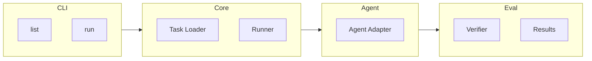

# Agent Bench

An open-source benchmark initiative for evaluating AI coding agents on real-world engineering tasks.

## Overview

Agent Bench creates reproducible evaluation environments derived from authentic development tasks. Unlike synthetic coding benchmarks, it focuses on genuine engineering challenges that reflect real-world software development complexity.

## Goals

1. **Realistic Evaluation** - Test AI agents on actual engineering problems
2. **Reproducible Benchmarking** - Standardized environments for consistent comparison
3. **Continuous Improvement** - Growing task collection to track agent progress

## Quick Start

### Prerequisites

- Rust 1.75+
- Git

### Installation

```bash
git clone https://github.com/jiahaoxiang2000/agent-bench.git
cd agent-bench
cargo build --release
```

### Usage

```bash
# List available tasks
agent-bench list

# Run a specific task
agent-bench run --task <task-id> --agent <agent-name>

# Run full benchmark suite
agent-bench run --suite all --agent <agent-name>
```

## Task Format

```yaml
id: BUG-001
title: "Fix race condition in cache invalidation"
category: bug-fix
difficulty: hard

source:
  repository: https://github.com/org/repo
  commit: abc123def456

prompt: |
  The cache invalidation has a race condition causing
  intermittent test failures. Fix the concurrency issue.

verification:
  type: pytest
  command: "pytest tests/test_cache.py -v"
  timeout: 60

metadata:
  tags: ["python", "concurrency"]
```

## Project Structure (MVP)

```
agent-bench/
├── src/
│   ├── main.rs             # Entry point
│   ├── cli.rs              # Command-line interface
│   ├── task.rs             # Task model and loader
│   ├── runner.rs           # Task execution
│   ├── agents/             # Agent adapters
│   │   ├── mod.rs
│   │   └── claude.rs
│   └── evaluator.rs        # Result verification
├── tasks/                  # Benchmark tasks
│   └── examples/
└── results/                # Run outputs
```

## Architecture (MVP)



## Evaluation Metrics

| Metric       | Description               |
| ------------ | ------------------------- |
| Success Rate | Tasks completed correctly |
| Iterations   | Attempts before success   |
| Token Usage  | Tokens consumed           |
| Duration     | Time to completion        |

## Roadmap

### MVP (Current)

- [x] Project setup
- [ ] Task loader and validator
- [ ] Single agent adapter (Claude)
- [ ] Basic runner (local execution)
- [ ] Test-based verification
- [ ] JSON results output

### Phase 2

- [ ] Additional agent adapters (OpenAI, local LLMs)
- [ ] Docker-based isolation
- [ ] HTML report generation
- [ ] Agent comparison tooling

### Phase 3

- [ ] Plugin architecture
- [ ] CI/CD integration
- [ ] Public leaderboard
- [ ] Multi-agent benchmarks

## Contributing Tasks

1. **Real-world Origin** - Tasks must come from actual development work
2. **Reproducibility** - Include all context to recreate the scenario
3. **Verifiability** - Provide automated tests that validate the solution

## License

MIT License - see [LICENSE](LICENSE) for details.
