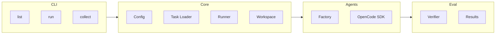

# Agent Bench

An open-source benchmark initiative for evaluating AI coding agents on real-world engineering tasks.

## Overview

Agent Bench creates reproducible evaluation environments derived from authentic development tasks. Unlike synthetic coding benchmarks, it focuses on genuine engineering challenges that reflect real-world software development complexity.

## Goals

1. **Realistic Evaluation** - Test AI agents on actual engineering problems
2. **Reproducible Benchmarking** - Standardized environments for consistent comparison
3. **Continuous Improvement** - Growing task collection to track agent progress

## Quick Start

### Prerequisites

- [Bun](https://bun.sh/) (>=1.0.0)
- Git

### Installation

```bash
git clone https://github.com/jiahaoxiang2000/agent-bench.git
cd agent-bench

# Install dependencies
bun install
```

### Usage

```bash
# List available tasks
bun run src/index.ts list

# Run a specific task
bun run src/index.ts run --task <task-id> --agent <agent-name>

# Run full benchmark suite
bun run src/index.ts run --suite all --agent <agent-name>

# Collect results into CSV
bun run src/index.ts collect                    # Creates results/summary.csv
bun run src/index.ts collect -o output.csv      # Custom output path

# Run with alternative API backends (via OpenCode SDK)
bun run src/index.ts run --task <task-id> --agent claude-deepseek
bun run src/index.ts run --task <task-id> --agent claude-kimi
bun run src/index.ts run --task <task-id> --agent claude-bigmodel
```

### Supported Agents

- **claude** - OpenCode SDK with standard Claude
- **claude-deepseek** - OpenCode SDK with DeepSeek API backend
- **claude-kimi** - OpenCode SDK with Kimi (Moonshot) API backend
- **claude-bigmodel** - OpenCode SDK with BigModel API backend

**Note**: Requires corresponding API keys in environment or `.env` file. Alternative backends are configured automatically by the OpenCode SDK.

## Task Format

```yaml
id: BUG-001
title: "Fix race condition in cache invalidation"
category: bug-fix
difficulty: hard

source:
  repository: https://github.com/org/repo
  commit: abc123def456

prompt: |
  The cache invalidation has a race condition causing
  intermittent test failures. Fix the concurrency issue.

verification:
  type: pytest
  command: "pytest tests/test_cache.py -v"
  timeout: 60

metadata:
  tags: ["python", "concurrency"]
```

## Project Structure

```
agent-bench/
├── src/
│   ├── cli/
│   │   └── commands/           # CLI commands
│   │       ├── collect.ts
│   │       ├── init.ts
│   │       ├── list.ts
│   │       ├── run.ts
│   │       └── verify.ts
│   │   └── index.ts            # CLI entry point
│   ├── agents/
│   │   ├── factory.ts          # Agent factory
│   │   ├── opencode.ts         # OpenCode SDK adapter
│   │   └── types.ts
│   ├── core/
│   │   ├── config.ts           # Configuration
│   │   ├── loader.ts           # Task loader
│   │   ├── runner.ts           # Task execution
│   │   ├── task.ts             # Task model
│   │   └── workspace.ts        # Workspace management
│   ├── evaluator/
│   │   ├── results.ts          # Result models
│   │   └── verifier.ts         # Result verification
│   └── utils/
│       ├── errors.ts           # Custom errors
│       └── logger.ts           # Logging
├── tasks/                      # Benchmark tasks (YAML format)
│   └── tools/
│       └── find-os-001.yaml    # Example task
├── results/                    # Run outputs (JSON + CSV)
├── package.json                # Project configuration (Bun)
└── tsconfig.json               # TypeScript configuration
```

## Architecture



## Configuration

The project uses TypeScript with strict mode enabled. All configuration is in:

- `package.json` - Dependencies and scripts
- `tsconfig.json` - TypeScript compiler options
- `bunfig.toml` - Bun runtime configuration

## Development

```bash
# Install dependencies
bun install

# Type check
bun run typecheck

# Run CLI in development
bun run src/index.ts <command>

# Run with debug output
bun run src/index.ts --debug <command>

# Build for production
bun run build
```

## Evaluation Metrics

| Metric       | Description               |
| ------------ | ------------------------- |
| Success Rate | Tasks completed correctly |
| Score        | 0-100 quality score       |
| Iterations   | Attempts before success   |
| Token Usage  | Tokens consumed           |
| Duration     | Time to completion        |

## Results Analysis

After running benchmarks, use the `collect` command to generate a CSV summary:

```bash
# Generate CSV from all JSON results
bun run src/index.ts collect

# View results in terminal
column -t -s, results/summary.csv

# Open in spreadsheet software
open results/summary.csv  # macOS
xdg-open results/summary.csv  # Linux
```

The CSV includes: task_id, agent, agent_version, model_name, timestamp, success, score, iterations, duration_secs, tokens_used, and error.

## Contributing Tasks

1. **Real-world Origin** - Tasks must come from actual development work
2. **Reproducibility** - Include all context to recreate the scenario
3. **Verifiability** - Provide automated tests that validate the solution

## License

MIT License - see [LICENSE](LICENSE) for details.
